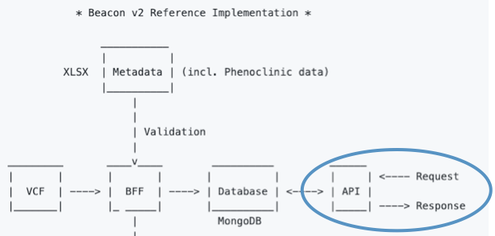

# Beacon v2 API

The Beacon v2 API enables us to formulate queries to our data  (i.e., it acts as intermediary between the user and the data). 

!!! Important "About Beacon v2 API"
    The Beacon v2 API follows [REST](https://en.wikipedia.org/wiki/Representational_state_transfer) principles and thus is called a **REST API**. 
    We will be using CRG's [API](https://dev.ega-archive.org/beacon-apis/cineca/) that consists of [synthetic data](./synthetic-dataset.md).



## API Endpoints

!!! Note  "API interactive documentation"
    Please find interactive API documentation from OpenAPI definitions [here](redoc-static.html).

Formally, queries are carried out by sending `requests` to Beacon v2 API `endpoints`. The API follows [OpenAPI v3.0.2 specification](https://spec.openapis.org/oas/v3.0.2) for the endpoints, in conjunction with [JSON Schema v2020-12](https://json-schema.org/draft/2020-12) to define the _Framework_ and the _Models_. The specification uses JSON references (`$ref`) to reference internal (e.g., definitions) or external concepts/terms (e.g., GA4GH Variation Representation Specification ([VRS](https://vrs.ga4gh.org/en/stable))). 

The endpoints are:

* the *root* (`/`) and `/info` that must return information (metadata) about the Beacon service and the organization supporting it. [Try it](https://dev.ega-archive.org/beacon-apis/cineca/info/).
* the `/service-info` endpoint that returns the Beacon metadata in the GA4GH Service Info schema.[Try it](https://dev.ega-archive.org/beacon-apis/cineca/service-info/).
* the `/configuration` endpoint that returns some configuration aspects and the definition of the entry types (e.g. *genomic variants*, *biosamples*, *cohorts*, *individuals* and *runs*) implemented in that specific Beacon server or instance. [Try it](https://dev.ega-archive.org/beacon-apis/cineca/configuration).

* the `/entry_types` endpoints that only return the section of the configuration that describes the entry types in that Beacon. [Try it](https://dev.ega-archive.org/beacon-apis/cineca/entry_types/).
* the `/map` endpoint that returns a map (like a web *sitemap*) of the different endpoints implemented in that Beacon instance. [Try it](https://dev.ega-archive.org/beacon-apis/cineca/map/).
* the `/filtering_terms` endpoint that returns a list of the filtering terms accepted by that Beacon instance. [Try it](https://dev.ega-archive.org/beacon-apis/cineca/filtering_terms/).

Most of these endpoints return the configuration files that are in the Beacon configuration folder. From now on we will only pay attention the endpoint **entry_types**. These entry types (sometimes referred as _entities_, _resources_ or _Beacon v2 Models endpoints_) mirror the _collections_ we have stored in _MongoDB_. Our collections are:

* analyses
* biosamples
* cohorts
* datasets
* genomicVariations
* individuals
* runs

## API Requests

The requests can be carried out by using `GET` or `POST` [http](https://en.wikipedia.org/wiki/Hypertext_Transfer_Protocol) methods.

`GET` requests are usually simpler, and can be performed directed in the [browser's URL bar](https://en.wikipedia.org/wiki/Address_bar) using a [query string](https://en.wikipedia.org/wiki/Query_string).
`POST` type requests are a bit more complex (they include JSON objects in the request _body_) and people resort to tools such as the command-line tool [curl](https://curl.se/). 

!!! Note "About cURL"

    **cURL** accepts `GET` and `POST` methods. <br />
     ```
     $ curl  https://www.mybeacon.org/api/individuals   # GET
     $ curl -X POST -H "Content-Type: application/json" --data @request.json https://www.mybeacon.org/api/  # POST
     ```

## Security attributes

Before performing any query we need to understand that there exist different types of "beacons" depending on the **security attributes**. The attributes can be adjusted at the **dataset** level.

### Granularity

While the original Beacon v1 only provided Boolean (i.e. YES/NO) responses on queries for the existence of specific genomic variants, Beacon v2 is a flexible protocol that supports different granularity levels of the response, such as `boolean`, `count`, and `record`.

| Granularity   |      Description      |
| --- | --- |
| Boolean |  returns 'true/false' responses |
| Count |    adds the total number of positive results found |
| Record | returns details for every document|
    
### API Security levels

Beacon v2 uses a 3-tiered access model: `public`, `registered`, and `controlled` access.

| Level   |      Description      |
| --- | --- |
| PUBLIC | Any anonymous user can read the data|
| REGISTERED | Only known users can read the data|
| CONTROLLED | Only specifically granted users can read the data |


!!! Warning "Beacon v2 instances and responses"

    Our Beacon v2 [API](https://dev.ega-archive.org/beacon-apis/cineca/) is set up as **Granularity: Record** and **Level: PUBLIC**. 
    <br />
    Beacon **response** has 5 parts: `meta, responseSummary, response->resultSets.results, beaconHandovers`. From now own, we will focus on `resultSets.results` part of the API response.

### Example query 1

Query -> GET all documents in endpoint `individuals`.

https://dev.ega-archive.org/beacon-apis/cineca/individuals

[Run query 1](https://dev.ega-archive.org/beacon-apis/cineca/individuals/)

### Example query 2

Query -> GET document for `id` HG00096 in endpoint `individuals`.

https://dev.ega-archive.org/beacon-apis/cineca/individuals/HG00096/

[Run query 2](https://dev.ega-archive.org/beacon-apis/cineca/individuals/HG00096/)

### Example query 3

We're going to scale-up a bit the complexity on this one. Here we'll introduce the concepts of **request parameters** and **filtering terms** (see description [here](https://github.com/ga4gh-beacon/beacon-framework-v2)), both used to refine the query.

!!! Note "About request parameters and filtering terms"
    Due to the fact that Beacon v2 does not enforce to use any particular _back-end_, at some point we need to map to vocabulary used in Beacon v2 API queries with the data stored in our database. In this regard **request parameters** function as "aliases" to (complex) objects in the Beacon v2 default schemas. In our case, since we're storing the data in MongoDB exactly in the same way as it is defined in the schemas, the hierarchy is the same. See examples below for the mapping of rquest parameters to the schemas for the collection `genomicVariations`;

    | Request Parameter   |      Full Hierarchy      |
    | --- | --- |
    |assemblyId| _position.assemblyId|
    |referenceName| _position.refseqId|
    |start| variation.location.interval.start|
    |end| variation.location.interval.end|
    |referenceBases| variation.referenceBases|
    |alternateBases| variation.alternateBases|
    |variantType| variation.variantType|
    |variantMinLength| None|
    |variantMaxLength| None|
    |mateName| None|
    |gene| molecularAttributes.geneIds|
    |aachange| molecularAttributes.aminoacidChanges|

    Anything that requires its own schema would be a request parameter.
    <br />

    **Filtering terms** are used to further refine queries. There exists four types of [filters](https://docs.genomebeacons.org/filters) `Bio-ontology`, `Custom`, `Numerical` and `Alphanumerical`. Anything that can be represented by an ontology term would go into the filters section.
    Filtering terms are specific to each Beacon implementation. You can check [here](https://dev.ega-archive.org/beacon-apis/cineca/filtering_terms) those implemented in the B2RI.

***QUERY:*** I have this mutation **p.Met734Val** in gene **_SCN5A_**, does Beacon XYZ also have this variant?

For the gene, we are going to use [OGG](https://www.ebi.ac.uk/ols/ontologies/ogg) ontology **OGG:3000006331** and the mutation will be expressed as **M734V**.

!!! Important
    **Ontologies** are defined at the database level, that is, the user has the freedom to choose which ontology terms describe their data.<br/>
    We are not enforcing to use any given ontology, as they depend on the domain of study, but we recommend using those defined in [Phenopackets](https://phenopacket-schema.readthedocs.io/en/latest/recommended-ontologies.html). We also provide **examples** in the documentation for [Beacon v2 Models](http://docs.genomebeacons.org).  <br/>
    For future versions, it is planned to allow for _on-the-fly_ ontology mapping. An example could be [SNOMED CT to ICD-10](https://www.nlm.nih.gov/research/umls/mapping_projects/snomedct_to_icd10cm.html) mapping.


```GET``` + request parameters:


```
https://beaconxyz.org/g_variants?geneId=OGG:3000006331&aminoacidChanges=M734V
```

```POST```
https://beaconxyz.org/g_variations
```json
"filters": [
 { "id": "OGG:3000006331",
  "scope": "genomicVariations"
 },
 { "id": "molecularAttributes.aminoacidChanges",
  "operator": "=",
  "value": "M734V",
  "scope": "genomicVariations"
 }
]
```

!!! Note "More examples of requests and responses"
    Please take a look at the [API documentation](https://github.com/EGA-archive/beacon2-ri-api/blob/master/deploy/README.md#usage).
