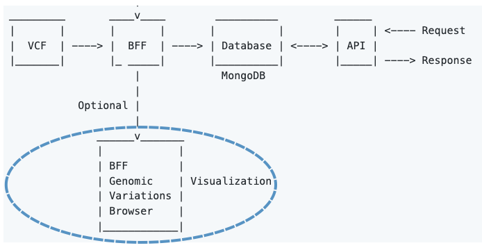
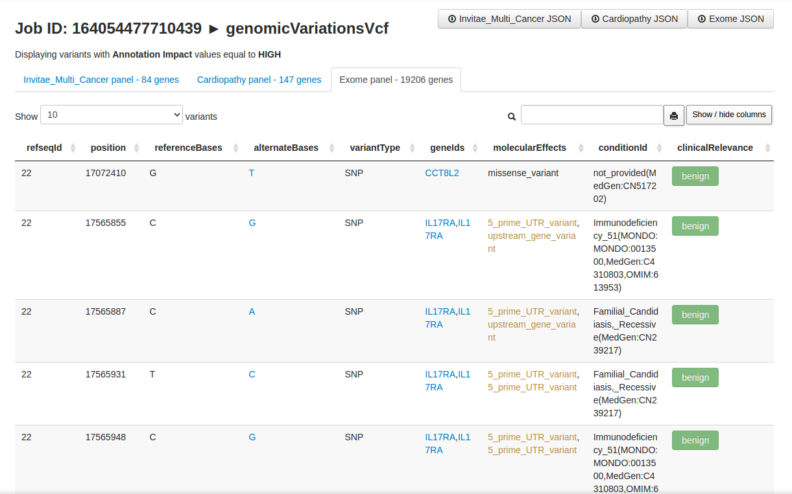

# BFF Genomic Variations Browser
---------------------

!!! Warning "Important"
    BFF Genomic Variations Browser **is not a full UI** for Beacon v2 as it does not allow for cross-queries to other collections (e.g., individuals).


**BFF Genomic Variations Browser** enables user-friendly visualization of ```genomicVariations``` documents (stored as a JSON array) via dynamic tables embedded in HTML.




The browser's [developer](./about.md) has first-hand experience in **Clinical Genomics** and thought that the HTML will be a nice addition for some users.


BFF Genomic Variations Browser only displays a subset o variants (i.e., those having **HIGH** value on the **Annotation Impact** field).

The variants are displayed as HMTL-tabs from gene lists (a.k.a. gene panels). These **gene panels** are plain text files consisting of one column (name of genes). The extension is '.lst'. 

By default, they're located under ```$beacon_path/browser/data```, but you can specify a different location via
the parameter ```paneldir``` in the ```config.yaml``` file.

BFF Genomic Variations Browser will display the filtered variants according to all ```.lst``` files in ```paneldir``` folder. 

The resulting HTML are **local**. They load a local JSON file and display it as a searchable table. 




The table allows for **columns re-ordering** and the **search** box accepts complex _regex_ e.g. ```rs12(3|4) (tp53|ace2) splice```.

Now, importing local JSON files (w/ [AJAX](https://en.wikipedia.org/wiki/Ajax_(programming))) is restricted by web browsers (by default). It's a security thing and makes sense most of the times.
However, it has no sense here and thus we will bypass this "functionality". It's harmless.
 
To overcome this issue we provide several alternatives, ranked by the level of difficulty.

1 - The simplest option is to use ***chromium-browser*** from the command line and add the flag ```--allow-file-access-from-files```, like this:

```
$ sudo apt install chromium-browser    # To install chromium in Debian-based distribution

$ cd beacon_XXX/browser   # where XXX is the job ID

$ chromium-browser --allow-file-access-from-files XXX.html
```

2 - The second simplest option is to use ***firefox*** and disable the restriction with the boolean ```privacy.file_unique_origin``` located in ```about:config``` (address bar). 

3 - The third option is to **load the HTML via http(s) protocol**. There are [quite a few ways](https://gist.github.com/willurd/5720255) of doing this (w/o resorting to apache2/nginx).

Below I am displaying a few:

* With Php

```
$ php -S localhost:8000
```

* With Ruby

```
$ ruby -run -e httpd . -p 8080
```

* With Python 3

```
python3 -m http.server
```

* Others

```
Mojolicius, Node.js and other web frameworks also allow for this. 
```
