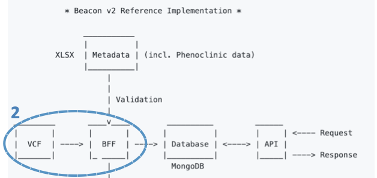
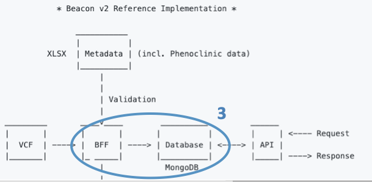
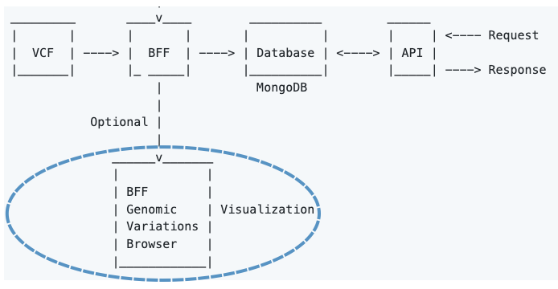
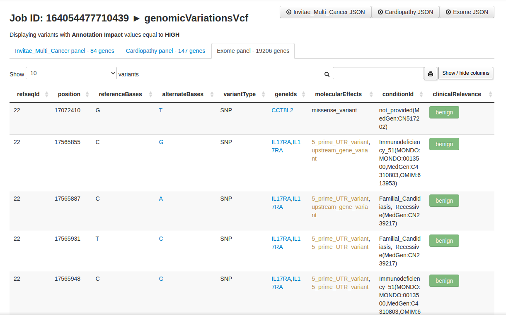

# Data ingestion

Data ingestion consists of 3 steps:

1. Transforming **metadata** (including phenotypic data).
2. Transforming **genomic variations** (VCF).
3. Load data into **MongoDB**.

!!! Important
    Here we will give you an overview of the tree steps. For an in depth explanation, please follow this [tutorial](./tutorial-data-beaconization.md).

## 1 - Transforming metadata (including phenotypic data)


The overall idea is that the **B2RI** will facilitate transforming your data (sequencing methodology, bioinformatics tools, phenotypic data, etc.) to the format of the [Beacon v2 Models](http://docs.genomebeacons.org/).

The [Beacon v2 Models](http://docs.genomebeacons.org/) define the default data structure (or schema) for the biological data responses. The Models are defined using [JSON Schema](https://json-schema.org) and the information is structured in a hierarchical form. The schemas consist of multiple properties or [terms](http://docs.genomebeacons.org/schemas-md/beacon_terms/) (a.k.a., objects). 

We have chosen **MongoDB** as a _de facto_ database as it works directly with JSON files. This way, we can store the data directly in the database according to the [Beacon v2 Models](http://docs.genomebeacons.org/) and provide responses (Beacon v2 compliant) without the need of re-mapping the data at the API level.

!!! Warning "About alternative response schemas for biological data"
    _A priori_, [Beacon v2](http://docs.genomebeacons.org/) specification allows for alternative schemas for the responses (e.g., [Phenopackets](https://phenopacket-schema.readthedocs.io/en/latest)). At this time (Apr-2022), this option is not supported by the Beacon v2 API. 

## 2 - Transforming genomic variations (VCF)



For genomic data, the B2RI has a tool that takes as input a [VCF](https://en.wikipedia.org/wiki/Variant_Call_Format) file and uses [BCFtools](http://samtools.github.io/bcftools/bcftools.html) and [SnpEff and SnpSift](http://pcingola.github.io/SnpEff) to annotate it. Once annotated, the tool transforms VCF data to the `genomicVariations` entry type in the Beacon v2 Models and serializes it to a JSON file.

## 3 - Load data into MongoDB



Once transformed, the JSON files conform what we call the **Beacon Friendly Format** (BFF).

The last step is loading the **BFF** files into a [MongoDB](https://www.mongodb.com) instance. 

The **B2RI** has a tool that loads BFF files to MongoDB. Once loaded, we will refer to them as **collections**.

## Included utilities

The data ingestion tools include a few utilities that will help you with data processing and beyond:

* [bff-api](https://github.com/EGA-archive/beacon2-ri-tools/tree/main/utils/bff_api)
* [bff-queue](https://github.com/EGA-archive/beacon2-ri-tools/tree/main/utils/bff_queue)
* [bff-validator](https://github.com/EGA-archive/beacon2-ri-tools/tree/main/utils/bff_validator)
                                                                                                        
## BFF Genomic Variations Browser

!!! Warning "Important"
    BFF Genomic Variations Browser **is not a full UI** for Beacon v2 as it does not allow for cross-queries to other collections (e.g., individuals).

**BFF Genomic Variations Browser** enables user-friendly visualization of ```genomicVariations``` documents (stored as a JSON array) via dynamic tables embedded in HTML.



The browser's [developer](./about.md) has first-hand experience in **Clinical Genomics** and thought that the HTML will be a nice addition for some users.

BFF Genomic Variations Browser only displays a subset o variants (i.e., those having **HIGH** value on the **Annotation Impact** field).

The variants are displayed as HMTL-tabs from gene lists (a.k.a. gene panels). These **gene panels** are plain text files consisting of one column (name of genes). The extension is '.lst'. By default, they're located under ```$beacon_path/browser/data```, but you can specify a different location via the parameter ```paneldir``` in the ```config.yaml``` file. Feel free to create and add **your own panels**.

BFF Genomic Variations Browser will display the filtered variants according to all ```.lst``` files in ```paneldir``` folder. 

The resulting HTML are **local**. They load a local JSON file and display it as a searchable table. 



The table allows for **columns re-ordering** and the **search** box accepts complex _regex_ e.g. ```rs12(3|4) (tp53|ace2) splice```.

Now, importing local JSON files (w/ [AJAX](https://en.wikipedia.org/wiki/Ajax_(programming))) is restricted by web browsers (by default). It's a security thing and makes sense most of the times.
However, it has no sense here and thus we will bypass this "functionality". It's harmless.
 
To overcome this issue we provide several alternatives, ranked by the level of difficulty.

1 - The simplest option is to use ***chromium-browser*** from the command line and add the flag ```--allow-file-access-from-files```, like this:

```
$ sudo apt install chromium-browser    # To install chromium in Debian-based distribution

$ cd beacon_XXX/browser   # where XXX is the job ID

$ chromium-browser --allow-file-access-from-files XXX.html
```

2 - The second simplest option is to use ***firefox*** and disable the restriction with the boolean ```privacy.file_unique_origin``` located in ```about:config``` (address bar). 

3 - The third option is to **load the HTML via http(s) protocol**. There are [quite a few ways](https://gist.github.com/willurd/5720255) of doing this (w/o resorting to apache2/nginx).

Below I am displaying a few:

* With Php

```
$ php -S localhost:8000
```

* With Ruby

```
$ ruby -run -e httpd . -p 8080
```

* With Python 3

```
python3 -m http.server
```

* Others

```
Mojolicius, Node.js and other web frameworks also allow for this. 
```
