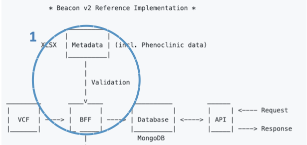
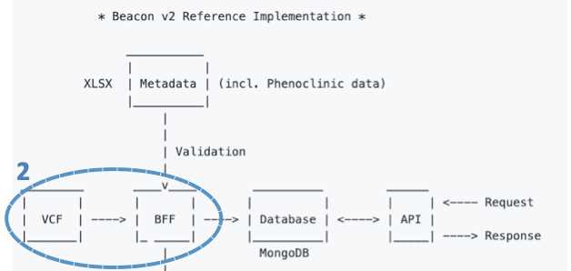
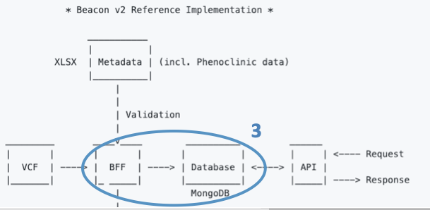

# Data ingestion

Data ingestion consists of 3 steps:

1. Transforming **metadata** (including phenotypic data).
2. Transforming **genomic variations** (VCF).
3. Load data into **MongoDB**.

!!! Important
    Here we will give you an overview of the tree steps. For an in depth explanation, please follow this [tutorial](./tutorial-data-beaconization.md).

## 1 - Transforming metadata (including phenotypic data)

The overall idea is that the **B2RI** will facilitate transforming your data (sequencing methodology, bioinformatics tools, phenotypic data, etc.) to the format of the [Beacon v2 Models](http://docs.genomebeacons.org/).

The [Beacon v2 Models](http://docs.genomebeacons.org/) define the default data structure (or schema) for the biological data responses. The Models are defined using [JSON Schema](https://json-schema.org) and the information is structured in a hierarchical form. The schemas consist of multiple properties or [terms](http://docs.genomebeacons.org/schemas-md/beacon_terms/) (a.k.a., objects). 

We have chosen **MongoDB** as a _de facto_ database as it works directly with JSON files. This way, we can store the data directly in the database according to the [Beacon v2 Models](http://docs.genomebeacons.org/) and provide responses (Beacon v2 compliant) without the need of re-mapping the data at the API level.

!!! Warning "About alternative response schemas for biological data"
    _A priori_, [Beacon v2](http://docs.genomebeacons.org/) specification allows for alternative schemas for the responses (e.g., [Phenopackets](https://phenopacket-schema.readthedocs.io/en/latest)). At this time (Apr-2022), this option is not supported by the Beacon v2 API. 

## 2 - Transforming genomic variations (VCF)

For genomic data, the B2RI has a tool that takes as input a [VCF](https://en.wikipedia.org/wiki/Variant_Call_Format) file and uses [BCFtools](http://samtools.github.io/bcftools/bcftools.html) and [SnpEff and SnpSift](http://pcingola.github.io/SnpEff) to annotate it. Once annotated, the tool transforms VCF data to the `genomicVariations` entry type in the Beacon v2 Models and serializes it to a JSON file.

## 3 - Load data into MongoDB

Once transformed, the JSON files conform what we call the **Beacon Friendly Format** (BFF).

The last step is loading the **BFF** files into a [MongoDB](https://www.mongodb.com) instance. 

The **B2RI** has a tool that loads BFF files to MongoDB. Once loaded, we will refer to them as **collections**.

## Included utilities

The data ingestion tools include a few utilities that will help you with data processing and beyond:

* [bff-api](https://github.com/EGA-archive/beacon2-ri-tools/tree/main/utils/bff_api)
* [bff-queue](https://github.com/EGA-archive/beacon2-ri-tools/tree/main/utils/bff_queue)
* [bff-validator](https://github.com/EGA-archive/beacon2-ri-tools/tree/main/utils/bff_validator)
* [models2xlsx](https://github.com/EGA-archive/beacon2-ri-tools/tree/main/utils/models2xlsx)
* [pxf2bff (experimental)](https://github.com/EGA-archive/beacon2-ri-tools/tree/main/utils/pxf2bff)
