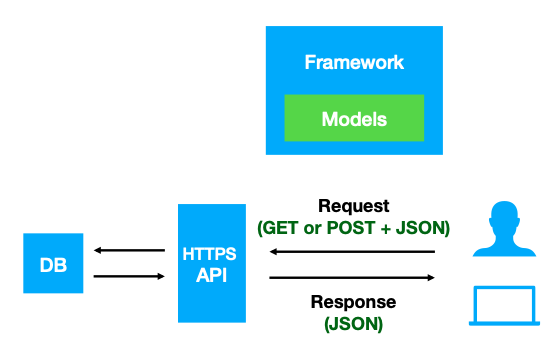

# Beacon v2

Beacon v2 is an **API specification** established by the **Global Alliance for Genomics and Health initiative** ([GA4GH](https://www.ga4gh.org)) that defines an open standard for federated discovery of genomic and phenotypic data in biomedical research and clinical applications. 

The [current version of the specification is v2](https://github.com/ga4gh-beacon/beacon-v2) and consists of two components, the _Framework_ and the _Models_. The **Framework**  defines the format for the requests and responses, whereas the **Models** define the [structure](https://json-schema.org/specification-links.html#2020-12) of the biological data response. The overall function of these two components is to provide the instructions to design a **REST API** (REpresentational State Transfer Application Programming Interface) with **OpenAPI** Specification (OAS). The [OAS](https://swagger.io/resources/open-api)  defines a standard, language-agnostic interface that is used by software developers to implement [REST APIs](https://en.wikipedia.org/wiki/Overview_of_RESTful_API_Description_Languages). 

!!! Note "Citation"
    **Beacon v2 and Beacon Networks: a "lingua franca" for federated data discovery in biomedical genomics, and beyond.**
    Jordi Rambla, Michael Baudis, Tim Beck, Lauren A. Fromont, Arcadi Navarro, Manuel Rueda, Gary Saunders, Babita Singh, J.Dylan Spalding, Juha Tornroos,  Claudia Vasallo, Colin D.Veal, Anthony J.Brookes.  _Human Mutation_ (2022) [DOI](https://doi.org/10.1002/humu.24369).

## Collaborators:

